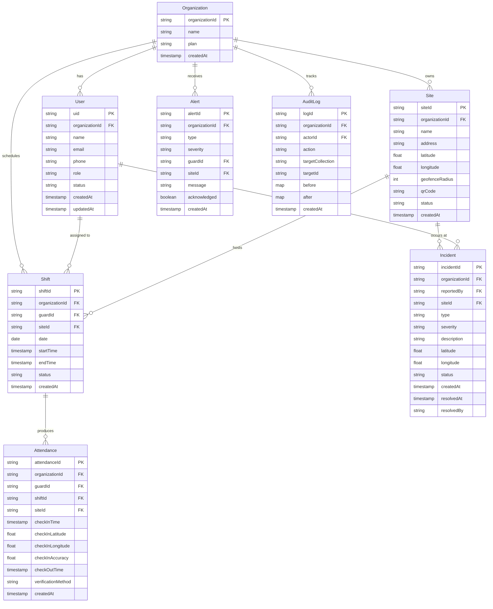
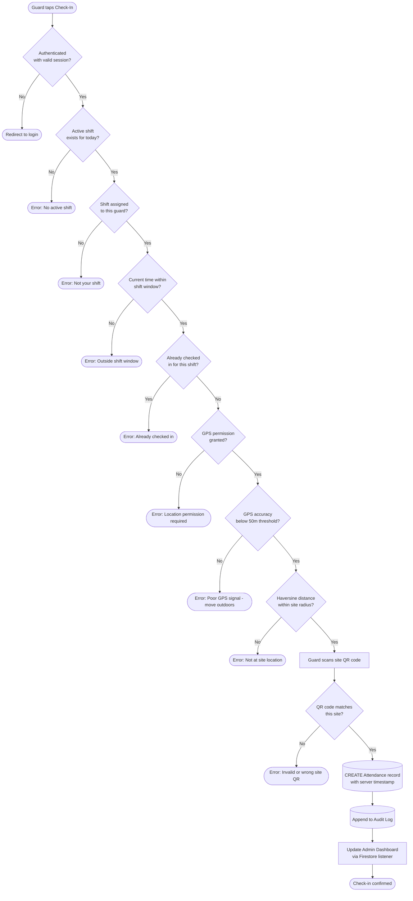
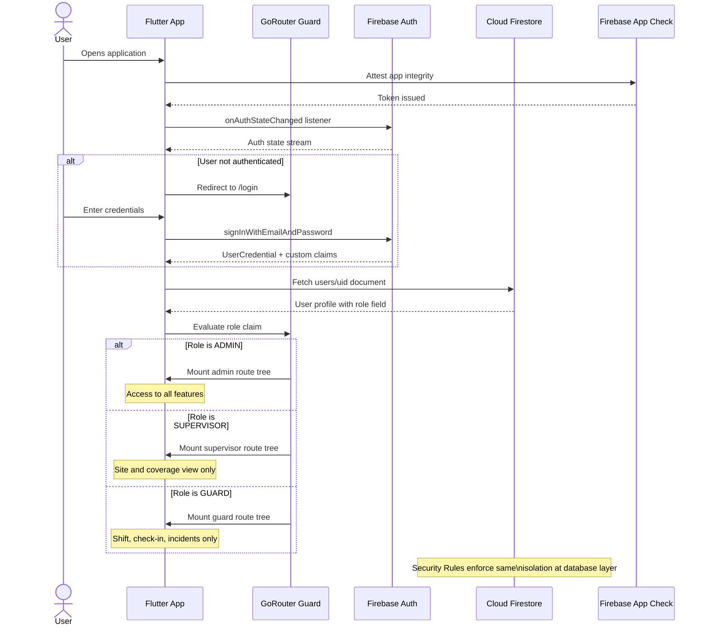
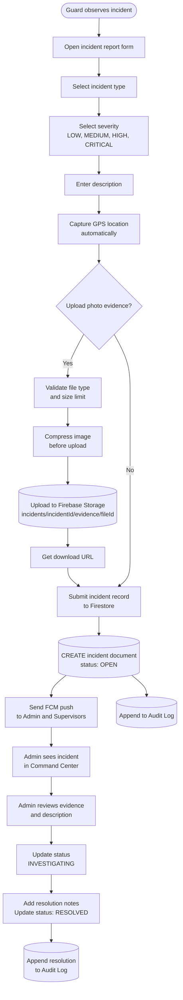
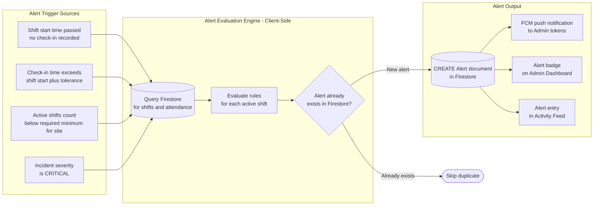
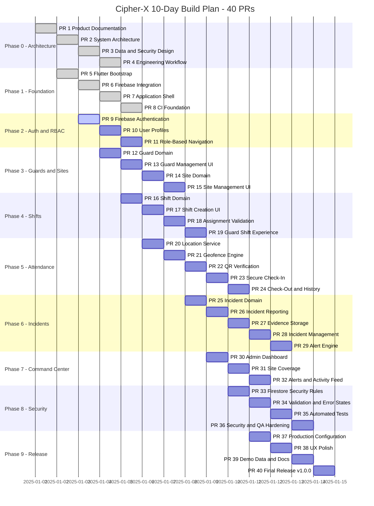

<div align="center">

<h1>Cipher-X</h1>

<p><strong>A startup-quality, real-time security workforce and operations management platform — multi-factor attendance verification, live site coverage, incident reporting with evidence, and an immutable audit trail. Built in 10 days on a zero-rupee infrastructure budget.</strong></p>

<br/>


<br/><br/>

</div>

---

## Table of Contents

- [The Problem](#the-problem)
- [The Solution](#the-solution)
- [Operational Loop](#operational-loop)
- [System Architecture](#system-architecture)
- [Firestore Data Model](#firestore-data-model)
- [Attendance Verification Engine](#attendance-verification-engine)
- [Authentication and RBAC Flow](#authentication-and-rbac-flow)
- [Incident and Evidence Pipeline](#incident-and-evidence-pipeline)
- [Alert Architecture](#alert-architecture)
- [10-Day Build Roadmap](#10-day-build-roadmap)
- [Tech Stack](#tech-stack)
- [Project Structure](#project-structure)
- [Security Model](#security-model)
- [Getting Started](#getting-started)
- [Firebase Emulator Setup](#firebase-emulator-setup)
- [Definition of Done](#definition-of-done)
- [Documentation Directory](#documentation-directory)
- [Team Decrypters](#team-decrypters)
- [Contributing](#contributing)
- [License](#license)

---

## The Problem

Security companies deploy hundreds of guards daily across dispersed locations. Head offices rely on phone calls and WhatsApp messages to confirm attendance, leading to systemic failures:

| Failure Mode | Reality |
|---|---|
| Attendance spoofing | Guards mark check-in from home via phone calls to supervisors |
| Zero real-time visibility | Head office has no live view of which sites are understaffed |
| Delayed incident response | Incident reports reach management hours after occurrence |
| No audit trail | Disputes over attendance, incidents, and shift changes have no verifiable history |
| Informal shift assignment | Shift scheduling happens over WhatsApp with no conflict checking |
| Missing evidence | Incidents reported verbally with no photos, timestamps, or location data |

---

## The Solution

Cipher-X is a closed-loop security operations platform that replaces every informal process with a structured, verifiable, and auditable digital workflow.

Rather than a single feature, the product is an **operational loop** — every action feeds the next stage, and nothing falls through.

---

## Operational Loop

```mermaid
flowchart LR
    ASSIGN([ASSIGN\nAdmin creates shift]) --> SHIFT[SHIFT\nGuard notified]
    SHIFT --> ARRIVE[ARRIVE\nGuard reaches site]
    ARRIVE --> VERIFY[VERIFY\nGPS + QR + Shift window]
    VERIFY --> CHECKIN[CHECK-IN\nAttendance record created]
    CHECKIN --> MONITOR[MONITOR\nAdmin dashboard updates]
    MONITOR --> ALERT[ALERT\nMissed shift or late detected]
    ALERT --> INCIDENT[INCIDENT\nGuard reports with evidence]
    INCIDENT --> RESOLVE[RESOLVE\nAdmin reviews and closes]
    RESOLVE --> AUDIT[AUDIT\nImmutable log entry created]
    AUDIT --> ASSIGN
```



Every stage is a distinct data event in Firestore. The loop runs continuously across all active sites and all deployed guards simultaneously.

---

## System Architecture

The full component topology of Cipher-X — feature-first Flutter application talking exclusively to the Firebase platform with zero paid backend infrastructure.

```mermaid
graph TB
    subgraph Flutter [Flutter App - Android, iOS, Web]
        subgraph UI [UI Layer]
            GUARD_UI[Guard App\nShift, Check-in, Incidents]
            ADMIN_UI[Admin Dashboard\nCoverage, Alerts, Reports]
            SUPERVISOR_UI[Supervisor View\nSite monitoring]
        end

        subgraph State [State Layer - Riverpod]
            ASYNC_NOTIFIER[AsyncNotifierProvider\nper feature]
            STREAM_PROVIDER[StreamProvider\nFirestore real-time listeners]
        end

        subgraph Repo [Repository Layer]
            AUTH_REPO[AuthRepository]
            GUARD_REPO[GuardRepository]
            SITE_REPO[SiteRepository]
            SHIFT_REPO[ShiftRepository]
            ATTEND_REPO[AttendanceRepository]
            INCIDENT_REPO[IncidentRepository]
            ALERT_REPO[AlertRepository]
            AUDIT_REPO[AuditRepository]
        end

        subgraph Engine [Verification Engine]
            GEO_ENGINE[GeofenceEngine\nHaversine distance]
            QR_ENGINE[QREngine\nSite code validation]
            SHIFT_ENGINE[ShiftValidator\nWindow and overlap check]
        end
    end

    subgraph Firebase [Firebase Platform - Zero Cost Tier]
        FA[Firebase Auth\nIdentity and custom role claims]
        FS[(Cloud Firestore\nMulti-tenant NoSQL)]
        FSTORAGE[Firebase Storage\nIncident evidence files]
        FCM[Firebase Cloud Messaging\nPush alerts]
        APPCHECK[Firebase App Check\nClient attestation]
    end

    subgraph Router [Navigation - GoRouter]
        GUARD_ROUTES[Guard routes]
        ADMIN_ROUTES[Admin routes]
        SUPERVISOR_ROUTES[Supervisor routes]
        ROLE_GUARD[Role-based route guard]
    end

    GUARD_UI --> ASYNC_NOTIFIER
    ADMIN_UI --> STREAM_PROVIDER
    ASYNC_NOTIFIER --> REPO
    STREAM_PROVIDER --> REPO
    REPO --> ENGINE
    AUTH_REPO --> FA
    GUARD_REPO --> FS
    SITE_REPO --> FS
    SHIFT_REPO --> FS
    ATTEND_REPO --> FS
    INCIDENT_REPO --> FS
    INCIDENT_REPO --> FSTORAGE
    ALERT_REPO --> FCM
    AUDIT_REPO --> FS
    APPCHECK --> FS
    APPCHECK --> FSTORAGE
    Router --> GUARD_ROUTES
    Router --> ADMIN_ROUTES
    Router --> SUPERVISOR_ROUTES
    ROLE_GUARD --> GUARD_ROUTES
    ROLE_GUARD --> ADMIN_ROUTES
    ROLE_GUARD --> SUPERVISOR_ROUTES
```



---

## Firestore Data Model

Multi-tenant Firestore schema. Every document is scoped to an `organizationId` ensuring complete isolation between tenants at the query and security rules layer.



---

## Attendance Verification Engine

The hero feature of Cipher-X. Multi-factor verification runs sequentially — every gate must pass before the attendance record is created.



---

## Authentication and RBAC Flow



---

## Incident and Evidence Pipeline



---

## Alert Architecture

The alert system is deliberately decoupled from any paid scheduler or backend function. Alert evaluation happens client-side on admin app launch and on a configurable periodic interval, keeping the architecture replaceable and the infrastructure cost at zero.



---

## 10-Day Build Roadmap



### Phase Summary

| Phase | Scope | Days | PRs |
|---|---|---|---|
| Phase 0 | Product and architecture documentation | Day 1 morning | 4 |
| Phase 1 | Flutter bootstrap, Firebase integration, CI | Day 1 afternoon | 4 |
| Phase 2 | Authentication, user profiles, RBAC routing | Day 2 | 3 |
| Phase 3 | Guard domain, site domain, management UIs | Day 3 | 4 |
| Phase 4 | Shift management, assignment validation, guard shift view | Day 4 | 4 |
| Phase 5 | Location service, geofence engine, QR, secure check-in, check-out | Days 5–6 | 5 |
| Phase 6 | Incident domain, reporting, evidence upload, incident management, alert engine | Day 7 | 5 |
| Phase 7 | Admin dashboard, site coverage, alerts and activity feed | Day 8 | 3 |
| Phase 8 | Firestore security rules, validation, automated tests, security hardening | Day 9 | 4 |
| Phase 9 | Production config, UX polish, demo data, final release | Day 10 | 4 |
| **Total** | | **10 days** | **40 PRs** |

---

## Tech Stack

All infrastructure runs on the Firebase free tier. Zero paid services required.

| Layer | Technology | Version | Purpose |
|---|---|---|---|
| Framework | Flutter | 3.x | Cross-platform mobile and web application |
| Language | Dart | 3.x | Type-safe application code |
| State management | Riverpod | Latest | AsyncNotifierProvider, StreamProvider, unidirectional data flow |
| Routing | GoRouter | Latest | Declarative navigation with role-based route guards |
| Data models | Freezed + json_serializable | Latest | Immutable data classes with value equality and JSON codegen |
| Authentication | Firebase Auth | Latest | Email/password login, custom role claims, session persistence |
| Database | Cloud Firestore | Latest | Real-time multi-tenant NoSQL with security rules |
| File storage | Firebase Storage | Latest | Incident evidence photos with type and size enforcement |
| Push notifications | Firebase Cloud Messaging | Latest | Alert delivery to admin and supervisor devices |
| App integrity | Firebase App Check | Latest | Client attestation preventing unauthorised API access |
| QR scanning | mobile_scanner | Latest | Camera-based QR code reading |
| Maps and geofence | geolocator + math | Latest | GPS permission, coordinates, Haversine distance calculation |

### Infrastructure Cost Breakdown

| Service | Free Tier Limit | Cipher-X Usage | Cost |
|---|---|---|---|
| Firebase Auth | Unlimited MAU | All users | Zero |
| Cloud Firestore | 1 GiB storage, 50k reads/day, 20k writes/day | Operational data | Zero |
| Firebase Storage | 5 GB storage, 1 GB/day download | Incident evidence | Zero |
| FCM | Unlimited messages | All push alerts | Zero |
| Firebase App Check | Included | All requests | Zero |
| Total | — | — | Zero |

---

## Project Structure

```
cipher-x/
|
+-- lib/
|   +-- app/
|   |   +-- app.dart                     # MaterialApp, theme, GoRouter configuration
|   |   +-- router.dart                  # All route definitions with role guard
|   |   +-- theme.dart                   # Light and dark theme configuration
|   |
|   +-- core/
|   |   +-- constants/                   # App constants, Firestore collection names
|   |   +-- errors/                      # Custom exception types, error formatting
|   |   +-- extensions/                  # Dart extensions (DateTime, String)
|   |   +-- services/
|   |   |   +-- firebase_service.dart    # Firebase initialisation and app check
|   |   |   +-- location_service.dart    # GPS permission and coordinate stream
|   |   |   +-- notification_service.dart# FCM token management and foreground handling
|   |   +-- utils/
|   |   |   +-- geofence_utils.dart      # Haversine distance calculation
|   |   |   +-- qr_utils.dart            # QR code generation and parsing
|   |   |   +-- shift_utils.dart         # Shift window and overlap validation
|   |   +-- widgets/
|   |       +-- loading_widget.dart
|   |       +-- error_widget.dart
|   |       +-- empty_state_widget.dart
|   |
|   +-- features/
|   |   +-- auth/
|   |   |   +-- data/                    # AuthRepository - Firebase Auth calls
|   |   |   +-- domain/                  # User model, role enum, auth state
|   |   |   +-- presentation/            # LoginScreen, SplashScreen, AuthController
|   |   +-- guards/
|   |   |   +-- data/                    # GuardRepository - Firestore CRUD
|   |   |   +-- domain/                  # Guard model, guard status enum
|   |   |   +-- presentation/            # GuardListScreen, GuardDetailScreen, CreateGuardScreen
|   |   +-- sites/
|   |   |   +-- data/                    # SiteRepository - Firestore CRUD, QR generation
|   |   |   +-- domain/                  # Site model with geofence fields
|   |   |   +-- presentation/            # SiteListScreen, SiteDetailScreen, CreateSiteScreen
|   |   +-- shifts/
|   |   |   +-- data/                    # ShiftRepository - CRUD, overlap validation
|   |   |   +-- domain/                  # Shift model, shift status enum
|   |   |   +-- presentation/            # ShiftCalendarScreen, CreateShiftScreen, GuardShiftScreen
|   |   +-- attendance/
|   |   |   +-- data/                    # AttendanceRepository - check-in, check-out
|   |   |   +-- domain/                  # Attendance model, verification method enum
|   |   |   +-- engines/
|   |   |   |   +-- geofence_engine.dart # Haversine verification with accuracy weighting
|   |   |   |   +-- qr_engine.dart       # QR payload validation against site document
|   |   |   |   +-- shift_engine.dart    # Sequential gate evaluation
|   |   |   +-- presentation/            # CheckInScreen, AttendanceHistoryScreen
|   |   +-- incidents/
|   |   |   +-- data/                    # IncidentRepository, evidence upload via Storage
|   |   |   +-- domain/                  # Incident model, severity enum, status enum
|   |   |   +-- presentation/            # ReportIncidentScreen, IncidentListScreen, IncidentDetailScreen
|   |   +-- alerts/
|   |   |   +-- data/                    # AlertRepository - create, acknowledge
|   |   |   +-- domain/                  # Alert model, alert type enum
|   |   |   +-- engine/
|   |   |   |   +-- alert_engine.dart    # Client-side rule evaluation against Firestore
|   |   |   +-- presentation/            # AlertFeedWidget, AlertBadgeWidget
|   |   +-- dashboard/
|   |       +-- data/                    # DashboardRepository - aggregated queries
|   |       +-- domain/                  # DashboardStats model
|   |       +-- presentation/            # AdminDashboardScreen, CoverageScreen, ActivityFeedScreen
|   |
|   +-- main.dart                        # Entry point, Firebase init, Riverpod scope
|
+-- test/
|   +-- unit/
|   |   +-- geofence_engine_test.dart    # Inside, outside, boundary, poor accuracy
|   |   +-- shift_validator_test.dart    # Overlap, inactive guard, invalid window
|   |   +-- attendance_test.dart         # Sequential gate tests
|   |   +-- rbac_test.dart               # Role permission matrix tests
|   |   +-- incident_test.dart           # Severity, status transitions
|   +-- widget/
|       +-- check_in_screen_test.dart
|       +-- dashboard_screen_test.dart
|
+-- firestore.rules                      # Firestore security rules with multi-tenant isolation
+-- storage.rules                        # Firebase Storage security rules for evidence
+-- firebase.json                        # Firebase project configuration
+-- .firebaserc                          # Firebase project aliases
+-- pubspec.yaml                         # Flutter dependencies
+-- analysis_options.yaml               # Dart linting rules
+-- .github/
|   +-- workflows/
|       +-- ci.yml                       # Flutter analyze, test, format on every PR
+-- docs/                                # Full documentation suite
+-- CONTRIBUTING.md
+-- LICENSE
+-- README.md
```

---

## Security Model

Cipher-X implements a three-layer defence-in-depth model.

**Layer 1 — Firebase App Check**: Every request to Firestore and Firebase Storage is attested by App Check. Requests from non-genuine clients (emulators, API scraping tools, modified APKs) are rejected before any data is accessed.

**Layer 2 — Firestore Security Rules**: Every read and write is evaluated against rules that enforce authentication, role verification, and organisation isolation. No client can bypass these rules regardless of what Flutter code sends.

**Layer 3 — Application RBAC**: GoRouter guards prevent unauthenticated or unauthorised navigation. Riverpod providers reject state mutations from non-privileged roles before any repository call is made.

### Security Rules Design Principles

| Principle | Implementation |
|---|---|
| Deny by default | All documents deny read and write unless a matching `allow` rule explicitly permits it |
| Authentication required | Every rule begins with `request.auth != null` — unauthenticated access is impossible |
| Organisation isolation | Every query and mutation must include `organizationId == request.auth.token.organizationId` |
| Role-based write control | Only users with the Admin or Supervisor role claim can write to guard, site, shift, and incident collections |
| Guard self-access only | Guards can only read their own user document and attendance records — not other guards' data |
| Immutable audit logs | Audit log documents deny update and delete — only create is permitted, enforcing an append-only ledger |
| Evidence access control | Firebase Storage rules restrict evidence downloads to users in the same organisation as the incident |

### Security Test Matrix (PR #33 and #36)

```
Guard reads another guard's document        -> DENY
Guard reads admin dashboard data            -> DENY
Guard modifies their own attendance record  -> DENY
Guard reads audit logs                      -> DENY
Organisation A reads Organisation B data    -> DENY
Unauthenticated request to any document     -> DENY
Admin creates a guard document              -> ALLOW
Guard creates attendance for own shift      -> ALLOW
Guard creates incident report               -> ALLOW
```

---

## Getting Started

### Prerequisites

| Requirement | Version | Notes |
|---|---|---|
| Flutter SDK | 3.41.0+ | [flutter.dev/get-started](https://docs.flutter.dev/get-started/install) |
| Dart SDK | 3.11.0+ | Bundled with Flutter |
| Firebase CLI | Latest | `npm install -g firebase-tools` |
| VS Code or Android Studio | Latest | With Flutter and Dart plugins |
| Java | 17+ | Required for Android build |

### Installation

```bash
# Clone the repository
git clone https://github.com/kalviumcommunity/-S116-0826-Decrypters-Full-Stack-With-Flutter-Dart-Firebase-CipherX.git
cd -S116-0826-Decrypters-Full-Stack-With-Flutter-Dart-Firebase-CipherX

# Install Flutter dependencies
flutter pub get

# Run code generation (Freezed and json_serializable)
dart run build_runner build --delete-conflicting-outputs
```

---

## Firebase Emulator Setup

Run the full Firebase backend locally with no cloud connection required — zero cost, zero quota consumption during development.

```bash
# Authenticate with Firebase
firebase login

# Start all required emulators
firebase emulators:start --only auth,firestore,storage

# Emulator UI available at:
# http://localhost:4000

# Individual emulator ports:
# Auth:      http://localhost:9099
# Firestore: http://localhost:8080
# Storage:   http://localhost:9199
```

Configure the Flutter app to point to local emulators by setting the `USE_EMULATOR=true` environment flag or via the `--dart-define` build flag.

### Launch the App

```bash
# Android device or emulator
flutter run -d android

# iOS simulator (macOS only)
flutter run -d ios

# Chrome (web)
flutter run -d chrome

# With specific device ID
flutter devices
flutter run -d <device_id>
```

### Code Quality

```bash
# Dart static analysis
flutter analyze

# Run unit and widget tests
flutter test

# Format code
dart format .

# Rebuild generated files after model changes
dart run build_runner build --delete-conflicting-outputs
```

---

## Definition of Done

A PR is not considered complete until every item is checked:

| Category | Checklist |
|---|---|
| Functionality | Feature works end-to-end |
| Code quality | `flutter analyze` passes with zero issues |
| Formatting | `dart format .` produces no changes |
| Tests | Relevant unit or widget tests pass |
| State coverage | Loading state, success state, error state, and empty state all exist |
| Security | Security implications reviewed — does this expose data incorrectly? |
| Firestore | Queries reviewed — are indexes required? Is pagination applied? |
| Stability | No obvious runtime errors on happy path or error path |
| UX | UI is usable on a physical device |
| Review | At least one teammate has reviewed and approved the PR |
| Docs | Relevant documentation updated if architecture or data model changed |

---

## Priority System

When time becomes tight, cut in this order:

| Priority | Features | Decision |
|---|---|---|
| P0 — Must ship | Auth, RBAC, Guards, Sites, Shifts, GPS, Geofence, QR, Check-in, Check-out, Incidents, Dashboard, Security Rules | Never cut |
| P1 — Should ship | Alerts, Evidence, Coverage, Audit logs, Analytics | Cut only if P0 is at risk |
| P2 — Can cut | Advanced animations, complex analytics, advanced filtering, video evidence | Cut first |
| P3 — Future | AI, face recognition, predictive absenteeism, payroll, chat, video calling | Not in MVP |

Never cut P0 security.

---

## Documentation Directory

| Document | Description |
|---|---|
| [PRODUCT_REQUIREMENTS.md](docs/PRODUCT_REQUIREMENTS.md) | Problem definition, target users, core workflows, success criteria |
| [SYSTEM_ARCHITECTURE.md](docs/SYSTEM_ARCHITECTURE.md) | Flutter architecture, Firebase topology, data flow diagrams |
| [TECH_STACK.md](docs/TECH_STACK.md) | Full technology choices with rationale and free-tier constraints |
| [USER_ROLES.md](docs/USER_ROLES.md) | RBAC matrix — Admin, Supervisor, Guard permissions per operation |
| [FIRESTORE_SCHEMA.md](docs/FIRESTORE_SCHEMA.md) | Complete collection and document schema with field types |
| [SECURITY_MODEL.md](docs/SECURITY_MODEL.md) | Security rules design, multi-tenant isolation, App Check configuration |
| [ATTENDANCE_VERIFICATION.md](docs/ATTENDANCE_VERIFICATION.md) | Geofence engine, QR validation, sequential gate specification |
| [INCIDENT_WORKFLOW.md](docs/INCIDENT_WORKFLOW.md) | Incident lifecycle, evidence upload pipeline, admin resolution flow |
| [ALERT_SYSTEM.md](docs/ALERT_SYSTEM.md) | Alert trigger rules, client-side evaluation architecture, FCM delivery |
| [AUDIT_LOGGING.md](docs/AUDIT_LOGGING.md) | Audit log schema, immutability enforcement, query patterns |
| [DEVELOPMENT_PLAN.md](docs/DEVELOPMENT_PLAN.md) | Full 10-day, 40-PR execution plan with daily sync ritual |
| [GIT_WORKFLOW.md](docs/GIT_WORKFLOW.md) | Branch strategy, commit convention, PR review process |
| [MVP_SCOPE.md](docs/MVP_SCOPE.md) | P0/P1/P2/P3 scope boundaries with cut decision rules |
| [CONTRIBUTING.md](CONTRIBUTING.md) | Contributor guidelines, PR checklist, ownership matrix |

---

## Team Decrypters

| Developer | Role | Ownership |
|---|---|---|
| Hardik Kaurani | Tech Lead and Architecture | System architecture, Firebase setup, Auth and RBAC, Firestore security rules, geofence engine, attendance verification, core integration, code review, release |
| Gauri | Guard Experience Lead | Guard mobile app, shift experience, GPS, QR scanner, check-in and check-out, incident reporting, evidence upload, guard UX |
| Avadhut | Admin and Operations Lead | Admin dashboard, guard management UI, site and geofence management UI, shift scheduler, coverage dashboard, incident management, alert UI, QA support, demo data |

---

## Contributing

See [CONTRIBUTING.md](CONTRIBUTING.md) for the full guide.

```bash
# Never push directly to main
git checkout -b feature/your-feature-name
git commit -m "feat(scope): describe your change"
git push origin feature/your-feature-name
# Open a Pull Request
```

**Branch naming**: `feature/auth`, `feature/sites`, `feature/shifts`, `feature/attendance`, `feature/incidents`, `feature/dashboard`

**Commit format examples**:

```
feat(auth): add firebase authentication
feat(attendance): implement geofence verification
fix(shifts): prevent overlapping assignments
test(attendance): add geofence validation tests
```

Every PR requires one reviewer. Never approve blindly.

---

## License

MIT License. See [LICENSE](LICENSE) for details.

---

<div align="center">

*Cipher-X — from informal WhatsApp attendance to a verifiable, real-time security operations platform.*

**Team Decrypters** — Hardik · Gauri · Avadhut

*10 Days. Startup Quality.*

</div>
